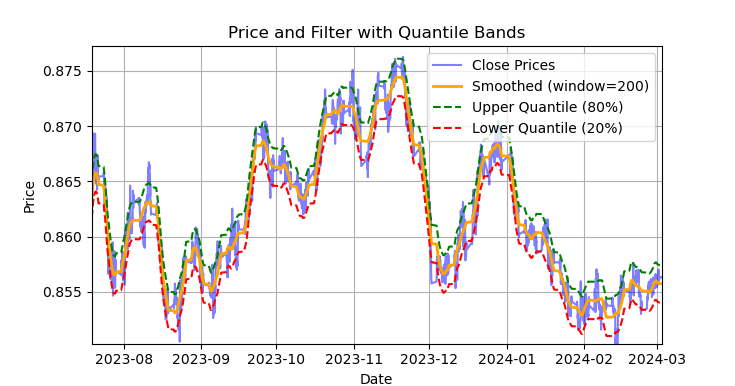
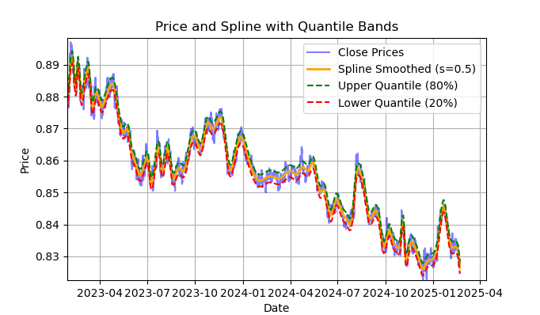
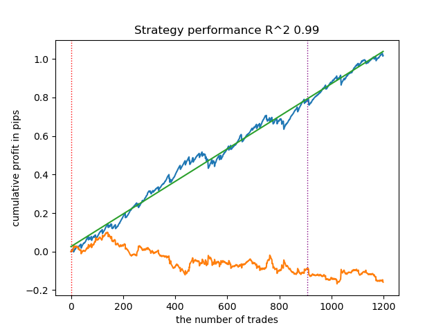
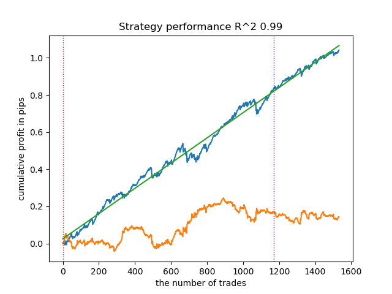
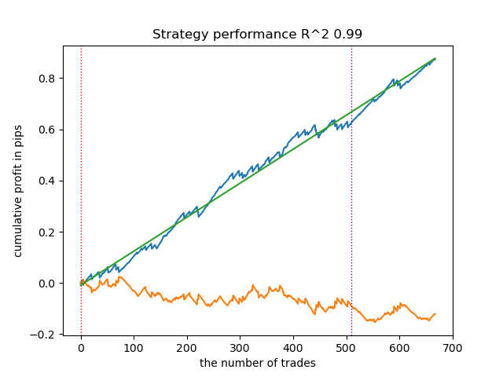
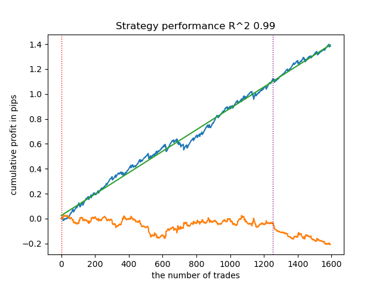
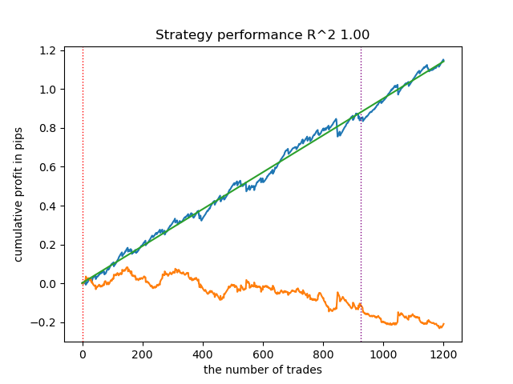
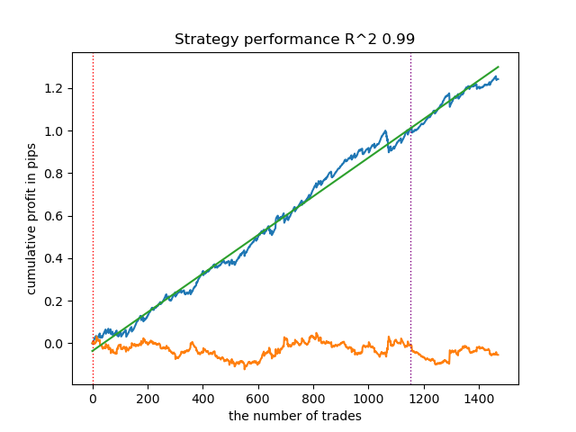
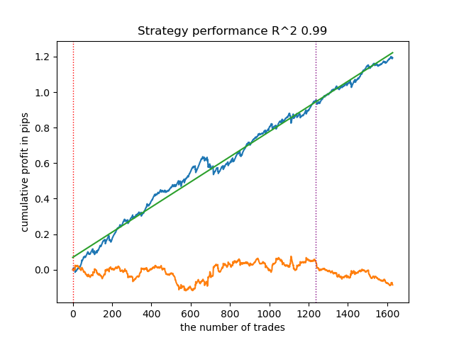
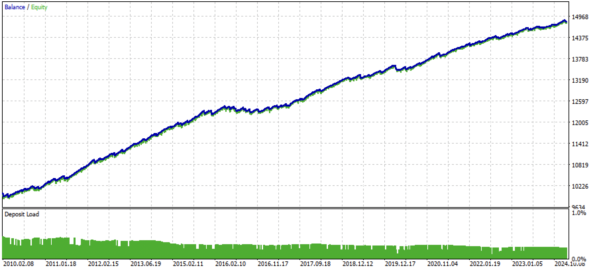

# Estratégia de Reversão à Média com Machine Learning

Pesquisa e implementação de modelos de machine learning para análise de séries temporais, classificação de regimes de mercado e desenvolvimento de estratégias quantitativas de reversão à média.

## Visão Geral

Este projeto demonstra uma abordagem completa para desenvolver sistemas de trading usando machine learning, com foco em estratégias de **reversão à média** aplicadas ao par de moedas **EURGBP** no timeframe H1.

A ideia central é combinar duas técnicas:

1. **Rotulagem de operações** — identificar automaticamente pontos de entrada e saída lucrativos nos dados históricos usando diferentes métodos de suavização e bandas de quantis.
2. **Clusterização de regimes de mercado** — dividir a série temporal em grupos (regimes) com características estatísticas distintas usando K-Means, e treinar um modelo separado para cada regime.

A combinação dessas técnicas resulta em modelos mais robustos e adaptáveis às mudanças nas condições de mercado, com curvas de equity consistentes validadas em dados fora da amostra (2021–2025).

---

## Conceitos Fundamentais

### Reversão à Média

A reversão à média é a tendência de um ativo financeiro de retornar ao seu valor médio após desvios. A estratégia identifica quando o preço se afasta significativamente da sua tendência suavizada e abre posições esperando o retorno à média.

### Rotulagem de Operações

Para treinar um classificador supervisionado, é necessário definir quais momentos históricos representam boas oportunidades de compra ou venda. Seis métodos de rotulagem são implementados, cada um com características distintas.

### Regimes de Mercado

O mercado alterna entre diferentes "modos" de comportamento (tendência, consolidação, alta volatilidade, etc.). Ao identificar em qual regime o mercado está, é possível aplicar o modelo treinado para aquele contexto específico, aumentando a precisão das previsões.

---

## Métodos de Rotulagem

### Método 1 — Filtro com Bandas de Quantis (Savitzky-Golay)

O preço é suavizado com um filtro Savitzky-Golay (janela=200). Bandas de quantis superiores (80%) e inferiores (20%) são calculadas dinamicamente ao redor da linha suavizada. Quando o preço cruza a banda superior, sinal de **venda**; quando cruza a inferior, sinal de **compra**.



---

### Método 2 — Suavização Spline com Bandas de Quantis

Variação que substitui o filtro Savitzky-Golay por uma suavização **Spline** (s=0.5). Esta abordagem adapta melhor a tendência de longo prazo, como pode ser observado no período de queda prolongada do EURGBP entre 2023 e 2025.



---

### Desempenho dos Métodos de Rotulagem

Cada método de rotulagem gera um conjunto de exemplos de treinamento que alimenta um classificador CatBoost. O desempenho é medido como **lucro acumulado em pips** ao longo do número de operações, com a linha verde representando a tendência linear (quanto mais próxima de R²=1.0, mais consistente).

As linhas tracejadas verticais separam os dados de **treino** (esquerda) dos dados de **validação fora da amostra** (direita). A curva azul deve permanecer crescente na região de validação para confirmar a generalização do modelo.

**Método 1 — Filtro simples** (R² = 0.99, ~1.200 operações):



**Método 2 — Múltiplos filtros** (R² = 0.99, ~1.500 operações):



**Método 3 — Rotulagem bidirecional** (R² = 0.99, ~680 operações):

Usa parâmetros de filtro diferentes para sinais de compra e venda, levando em conta a assimetria do comportamento do mercado.



**Método 4 — Abordagem multi-janela** (R² = 0.99, ~1.600 operações):

Implementa detecção hierárquica de sinais em múltiplos períodos de filtro, aumentando a diversidade dos exemplos rotulados.



**Método 5 — Reversão à média com restrições de lucratividade** (R² = 1.00, ~1.200 operações):

Adiciona validação de que as operações marcadas são de fato lucrativas em períodos futuros definidos, melhorando a qualidade dos rótulos. Este método produziu os resultados mais estáveis.



**Método 6 — Rotulagem ajustada por volatilidade** (R² = 0.99, ~1.500 operações):

Divide os dados em 20 grupos de volatilidade e calcula quantis dinâmicos para cada grupo, endereçando as mudanças nas condições de mercado ao longo do tempo.



**Resultado combinado — Melhor configuração** (R² = 0.99, ~1.700 operações):



---

## Arquitetura dos Modelos

Para cada cluster (regime de mercado), dois classificadores CatBoost são treinados:

| Modelo | Entrada | Saída |
|--------|---------|-------|
| **Modelo principal** | Features de médias móveis | Direção da operação (compra/venda) |
| **Meta-modelo** | Features de assimetria (skewness) | Confirmação do regime de mercado atual |

O meta-modelo responde à pergunta: *"O mercado atual se parece com o regime em que o modelo principal foi treinado?"*. Somente quando o meta-modelo confirma o regime (probabilidade > 0.5) é que o sinal do modelo principal é executado.

### Clusterização por Regime de Mercado

O K-Means é aplicado sobre features de **assimetria (skewness)** da série temporal para identificar os regimes. A assimetria mede o quanto a distribuição dos retornos se desvia da simetria e é um bom indicador do comportamento direcional do mercado. O número ótimo de clusters recomendado é entre **5 e 10**.

---

## Exportação para ONNX e Integração com MetaTrader 5

Após o treinamento em Python, os modelos são exportados para o formato **ONNX** (Open Neural Network Exchange), que é compatível com o MetaTrader 5. O processo gera:

- `catmodel EURGBP_H1 0.onnx` — Modelo principal
- `catmodel_m EURGBP_H1 0.onnx` — Meta-modelo
- `EURGBP_H1 ONNX include 0.mqh` — Arquivo de inclusão MQL5 com definição das features e funções auxiliares

---

## Expert Advisor (EA) no MetaTrader 5

O arquivo `Mean Reversion.mq5` implementa o robô de trading que:

1. Calcula as features a cada novo candle fechado
2. Executa o meta-modelo para verificar se o regime atual é compatível
3. Executa o modelo principal para obter o sinal direcional
4. Abre posição somente quando ambos os modelos concordam
5. Gerencia as posições com **stop-loss** e **take-profit** configuráveis

### Resultado do Backtesting no MetaTrader 5

Backtesting no par EURGBP H1, período de **2010 a 2024**, com curva de equity consistentemente crescente e drawdown controlado:



---

## Estrutura do Projeto

```
.
├── Python/
│   ├── EURGBP_H1.csv          # Dados históricos EURGBP H1
│   ├── mean reversion.py      # Script principal (treinamento e exportação)
│   ├── labeling_lib.py        # Biblioteca com os 6 métodos de rotulagem
│   ├── tester_lib.py          # Biblioteca de avaliação de desempenho
│   └── export_lib.py          # Exportação dos modelos para ONNX + MQL5
│
├── MQL5/
│   ├── Mean Reversion.mq5     # Código-fonte do Expert Advisor
│   ├── Mean Reversion.ex5     # EA compilado (pronto para uso no MT5)
│   └── Include/
│       └── Mean Reversion/
│           ├── catmodel EURGBP_H1 0.onnx        # Modelo principal
│           ├── catmodel_m EURGBP_H1 0.onnx      # Meta-modelo
│           └── EURGBP_H1 ONNX include 0.mqh     # Definições de features
│
└── Imagens/                   # Visualizações geradas pelo script Python
```

---

## Pré-requisitos

### Python

```bash
pip install numpy pandas scipy scikit-learn catboost numba
```

> **Nota:** O CatBoost possui suporte nativo a exportação ONNX. Verifique a compatibilidade das versões antes de instalar.

### MetaTrader 5

- MetaTrader 5 instalado (build 2755 ou superior para suporte ONNX)
- Conta de demonstração ou real na corretora de sua escolha

---

## Passo a Passo de Uso

### 1. Preparar os dados

Coloque seu arquivo CSV com dados históricos OHLCV na pasta `Python/`. O arquivo deve ter as colunas: `Date`, `Open`, `High`, `Low`, `Close`, `Volume`.

O arquivo `EURGBP_H1.csv` já está incluído como exemplo para o par EURGBP no timeframe H1.

### 2. Executar o treinamento

Abra e execute o script principal em um Jupyter Notebook ou diretamente:

```bash
cd Python
python "mean reversion.py"
```

O script irá:
- Carregar os dados históricos
- Aplicar os métodos de rotulagem e exibir os gráficos de performance
- Executar a clusterização K-Means para identificar regimes de mercado
- Treinar os modelos CatBoost (modelo principal + meta-modelo) para cada cluster
- Exportar os modelos no formato ONNX
- Gerar o arquivo `.mqh` de inclusão para o MQL5

### 3. Copiar os arquivos para o MetaTrader 5

Copie os arquivos gerados para as pastas correspondentes do MetaTrader 5:

```
# Arquivo do EA
Mean Reversion.mq5  →  [MT5_DATA_FOLDER]/MQL5/Experts/

# Modelos ONNX e include
MQL5/Include/Mean Reversion/  →  [MT5_DATA_FOLDER]/MQL5/Include/Mean Reversion/
```

> Para localizar a pasta de dados do MT5: abra o terminal → menu `Arquivo` → `Abrir Pasta de Dados`.

### 4. Compilar o Expert Advisor

No MetaTrader 5:
1. Abra o **MetaEditor** (`F4` ou menu Ferramentas)
2. Navegue até `Experts/Mean Reversion.mq5`
3. Compile com `F7`
4. Confirme que não há erros de compilação

Alternativamente, o arquivo `Mean Reversion.ex5` já compilado está incluído no repositório e pode ser usado diretamente.

### 5. Configurar e executar o backtesting

No MetaTrader 5:
1. Abra o **Strategy Tester** (`Ctrl+R`)
2. Selecione o EA `Mean Reversion`
3. Configure o par `EURGBP`, timeframe `H1`
4. Defina o período de teste desejado
5. Clique em **Iniciar**

### 6. Executar em conta real ou demonstração

Após validar o backtesting:
1. Arraste o EA `Mean Reversion` para o gráfico EURGBP H1
2. Configure os parâmetros de stop-loss e take-profit
3. Habilite o **trading automático** (botão verde na barra de ferramentas)

---

## Personalização

Para adaptar o projeto a outro par ou timeframe:

1. Substitua o arquivo CSV pelos dados do novo ativo
2. Ajuste os parâmetros de janela dos filtros em `labeling_lib.py`
3. Experimente diferentes números de clusters (5–10 é o recomendado)
4. Reexecute o treinamento e exporte os novos modelos ONNX
5. Atualize os arquivos na pasta do MetaTrader 5

---

## Resultados e Conclusões

Os testes demonstraram que a combinação de **rotulagem de operações** com **clusterização de regimes de mercado** produz resultados superiores em comparação com qualquer uma das abordagens isoladamente. Os destaques:

- Todos os 6 métodos de rotulagem geraram R² ≥ 0.99 nos dados de validação
- O método de reversão à média com restrições de lucratividade (Método 5) atingiu R² = 1.00
- O backtesting no MetaTrader 5 confirmou curva de equity crescente e estável de 2010 a 2024
- O framework é facilmente adaptável a outros pares e timeframes

---

<sub>Baseado no artigo: <a href="https://www.mql5.com/en/articles/16457">Creating a mean-reversion strategy based on machine learning</a></sub>
