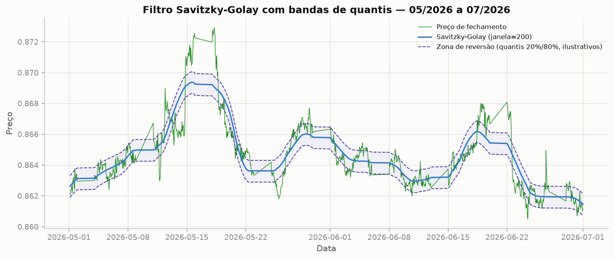
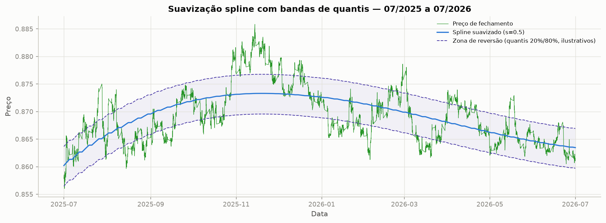
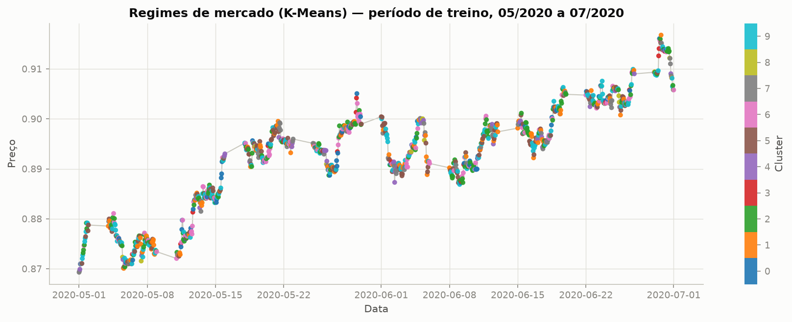
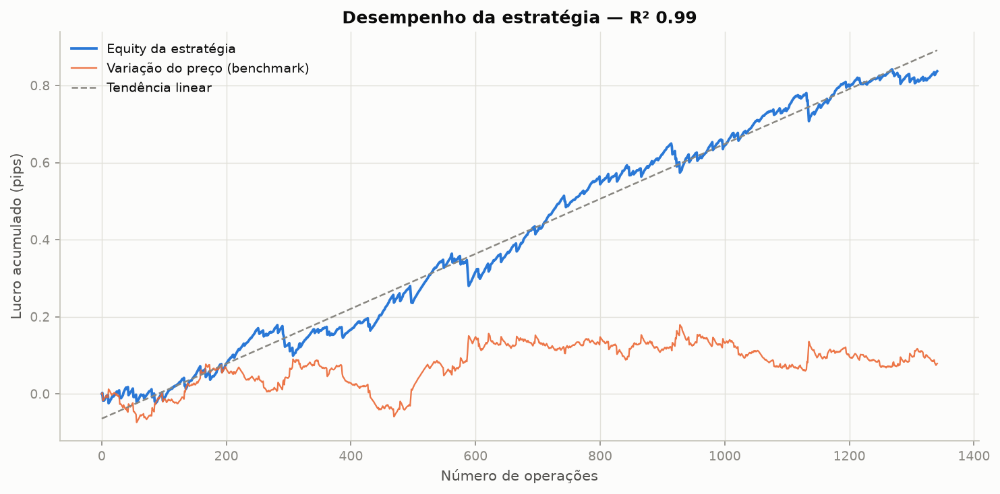
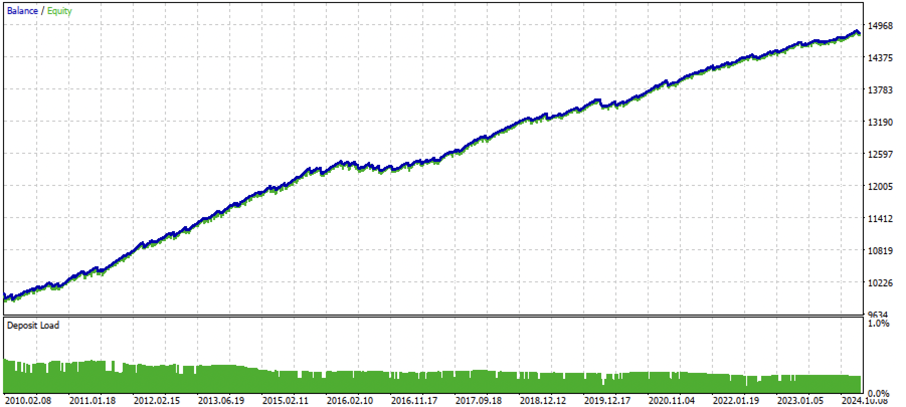

# Estratégia de Reversão à Média com Machine Learning

Pesquisa e implementação de modelos de machine learning para análise de séries temporais, classificação de regimes de mercado e desenvolvimento de estratégias quantitativas de reversão à média.

## Visão Geral

Este projeto demonstra uma abordagem completa para desenvolver sistemas de trading usando machine learning, com foco em estratégias de **reversão à média** aplicadas ao par de moedas **EURGBP** no timeframe H1.

A ideia central é combinar duas técnicas:

1. **Rotulagem de operações** — identificar automaticamente pontos de entrada e saída lucrativos nos dados históricos usando diferentes métodos de suavização e bandas de quantis.
2. **Clusterização de regimes de mercado** — dividir a série temporal em grupos (regimes) com características estatísticas distintas usando K-Means, e treinar um modelo separado para cada regime.

A combinação dessas técnicas resulta em modelos mais robustos e adaptáveis às mudanças nas condições de mercado, validados em dados fora da amostra.

---

## Conceitos Fundamentais

### Reversão à Média

A reversão à média é a tendência de um ativo financeiro de retornar ao seu valor médio após desvios. A estratégia identifica quando o preço se afasta significativamente da sua tendência suavizada e abre posições esperando o retorno à média.

### Rotulagem de Operações

Para treinar um classificador supervisionado, é necessário definir quais momentos históricos representam boas oportunidades de compra ou venda. Seis métodos de rotulagem são implementados, cada um com características distintas.

### Regimes de Mercado

O mercado alterna entre diferentes "modos" de comportamento (tendência, consolidação, alta volatilidade, etc.). Ao identificar em qual regime o mercado está, é possível aplicar o modelo treinado para aquele contexto específico, aumentando a precisão das previsões.

---

## Métodos de Rotulagem

Todos os métodos partem do mesmo princípio: medir o desvio do preço em relação a uma linha suavizada e marcar **venda** quando o desvio ultrapassa o quantil superior e **compra** quando cai abaixo do quantil inferior. **No treinamento, os quantis usados são 45%/55%** — as figuras abaixo desenham bandas de 20%/80% apenas por serem mais fáceis de visualizar.

### Método 1 — Filtro Savitzky-Golay com Bandas de Quantis (`get_labels_filter`)

O preço é suavizado com um filtro Savitzky-Golay (janela=200). Bandas de quantis são calculadas sobre o desvio do preço em relação à linha suavizada. Desvio acima da banda superior → sinal de **venda**; abaixo da inferior → sinal de **compra**.



### Método 2 — Múltiplos Filtros com Quantis Dinâmicos (`get_labels_multiple_filters`)

Aplica o filtro Savitzky-Golay em múltiplos períodos (50, 100, 200) com quantis calculados em janelas deslizantes. A detecção é **hierárquica**: o primeiro filtro que disparar define o rótulo, o que aumenta a quantidade e a diversidade dos exemplos.

### Método 3 — Filtro Bidirecional (`get_labels_filter_bidirectional`)

Usa parâmetros de filtro **diferentes para compra e venda**, levando em conta a assimetria do comportamento do mercado.

### Método 4 — Reversão à Média com Restrições de Lucratividade (`get_labels_mean_reversion`)

Além do desvio em relação à média (suavização por spline, média móvel ou Savitzky-Golay), exige que a operação marcada seja **de fato lucrativa** em um horizonte futuro aleatório de 1 a 15 candles, eliminando falsos sinais e melhorando a qualidade dos rótulos.

A suavização spline adapta bem a tendência de longo prazo:



### Método 5 — Reversão à Média Multi-Janela (`get_labels_mean_reversion_multi`)

Combina **múltiplas suavizações spline** com fatores diferentes (0.2, 0.3, 0.5). O sinal só é gerado por **consenso**: todas as janelas precisam concordar com o desvio, além da restrição de lucratividade futura.

### Método 6 — Rotulagem Ajustada por Volatilidade (`get_labels_mean_reversion_v`)

Divide os dados em 20 grupos de volatilidade e calcula quantis dinâmicos para cada grupo, adaptando as zonas de reversão às mudanças nas condições de mercado ao longo do tempo.

> Cada método gera um conjunto diferente de exemplos de treinamento. O gráfico de desempenho é gerado automaticamente ao final de cada execução.

---

## Arquitetura dos Modelos

Para cada cluster (regime de mercado), dois classificadores CatBoost são treinados:

| Modelo | Entrada | Saída |
|--------|---------|-------|
| **Modelo principal** | Features de médias móveis | Direção da operação (compra/venda) |
| **Meta-modelo** | Features de assimetria (skewness) | Confirmação do regime de mercado atual |

O meta-modelo responde à pergunta: *"O mercado atual se parece com o regime em que o modelo principal foi treinado?"*. Somente quando o meta-modelo confirma o regime (probabilidade > 0.5) é que o sinal do modelo principal é executado.

### Clusterização por Regime de Mercado

O K-Means é aplicado sobre features de **assimetria (skewness)** da série temporal para identificar os regimes. A assimetria mede o quanto a distribuição dos retornos se desvia da simetria e é um bom indicador do comportamento direcional do mercado. O número ótimo de clusters recomendado é entre **5 e 10**.



---

## Avaliação — Como Ler o Gráfico de Desempenho

O tester interno simula as operações candle a candle e produz o gráfico abaixo:



- **Linha azul — equity da estratégia**: lucro acumulado (em pips) operação após operação, já descontando o `markup` (spread).
- **Linha laranja — variação do preço (benchmark)**: a variação bruta do preço acumulada nas mesmas operações. Serve de referência: se a azul sobe enquanto a laranja anda de lado ou cai, o lucro vem da **seleção das operações** (alfa), e não de simplesmente surfar a direção do mercado.
- **Linha cinza tracejada — tendência linear**: reta ajustada à curva de equity. O **R²** do título mede a aderência a essa reta — quanto mais próximo de 1.0, mais consistente (linear) é o crescimento do lucro.

---

## Exportação para ONNX e Integração com MetaTrader 5

Após o treinamento em Python, os modelos são exportados para o formato **ONNX** (Open Neural Network Exchange), que é compatível com o MetaTrader 5. O processo gera:

- `catmodel_EURGBP_H1_0.onnx` — Modelo principal
- `catmodel_m_EURGBP_H1_0.onnx` — Meta-modelo
- `EURGBP_H1_ONNX_include_0.mqh` — Arquivo de inclusão MQL5 com definição das features e funções auxiliares

---

## Expert Advisor (EA) no MetaTrader 5

O arquivo `Mean_Reversion.mq5` implementa o robô de trading que:

1. Calcula as features a cada novo candle fechado
2. Executa o meta-modelo para verificar se o regime atual é compatível
3. Executa o modelo principal para obter o sinal direcional
4. Abre posição somente quando ambos os modelos concordam
5. Gerencia as posições com **stop-loss** e **take-profit** configuráveis

### Resultado do Backtesting no MetaTrader 5

Backtesting no par EURGBP H1, período de **2010 a 2024**, com curva de equity consistentemente crescente e drawdown controlado:



---

## Estrutura do Projeto

```
.
├── Python/
│   ├── EURGBP_H1.csv          # Dados históricos EURGBP H1 (2010–2026)
│   ├── mean_reversion.py      # Ponto de entrada — pipeline completo
│   ├── data_lib.py            # Carregamento de dados (2 formatos) + features
│   ├── labeling_lib.py        # Biblioteca com os métodos de rotulagem
│   ├── tester_lib.py          # Biblioteca de avaliação de desempenho
│   ├── export_lib.py          # Exportação dos modelos para ONNX + MQL5
│   └── viz_lib.py             # Tema visual dos gráficos
│
├── MQL5/
│   ├── Experts/
│   │   ├── Mean_Reversion.mq5               # Código-fonte do Expert Advisor
│   │   └── Mean_Reversion.ex5               # EA compilado (pronto para uso no MT5)
│   └── Include/
│       └── Mean_Reversion/
│           ├── catmodel_EURGBP_H1_0.onnx    # Modelo principal
│           ├── catmodel_m_EURGBP_H1_0.onnx  # Meta-modelo
│           └── EURGBP_H1_ONNX_include_0.mqh # Definições de features
│
└── Imagens/                   # Visualizações geradas pelo pipeline
```

---

## Dados

O arquivo `Python/EURGBP_H1.csv` cobre **janeiro/2010 a julho/2026** (barras H1 alinhadas à hora cheia, fuso do broker UTC+2/+3 com horário de verão).

Dois formatos de CSV são aceitos — a detecção é automática pelo cabeçalho (`data_lib.load_prices`):

**1. Genérico** (separado por vírgula):

```
Date,Time,Open,High,Low,Close,Volume
20100104,00:00:00,0.88822,0.88832,0.88680,0.88680,1412
```

**2. Export padrão do MetaTrader 5** (separado por tab — retrocompatível):

```
<DATE>	<TIME>	<OPEN>	<HIGH>	<LOW>	<CLOSE>	<TICKVOL>	<VOL>	<SPREAD>
2010.01.04	00:00:00	0.88822	0.88832	0.88680	0.88680	1412	0	30
```

> Apenas a coluna de fechamento (`Close`) é usada pelo pipeline.

---

## Pré-requisitos

### Python

Com [uv](https://docs.astral.sh/uv/) (recomendado — cria o ambiente virtual isolado em `.venv/`, já ignorado pelo git):

```bash
uv sync
```

Ou com pip tradicional:

```bash
pip install numpy pandas scipy scikit-learn catboost numba matplotlib
```

> **Nota:** O CatBoost possui suporte nativo a exportação ONNX. Verifique a compatibilidade das versões antes de instalar.

### MetaTrader 5

- MetaTrader 5 instalado (build 2755 ou superior para suporte ONNX)
- Conta de demonstração ou real na corretora de sua escolha

---

## Passo a Passo de Uso

### 1. Preparar o ambiente (primeira vez)

No Windows (PowerShell/CMD) ou Linux, tanto faz — o [uv](https://docs.astral.sh/uv/) resolve igual:

```bash
# 1. Na raiz do repositório
cd <CAMINHO_DO_REPO>/Time_Series_Forecasting_ML

# 2. Criar o ambiente virtual isolado (.venv/) e instalar as dependências (~1–2 min)
uv sync
```

### 2. Executar o treinamento

Um único comando executa a sequência completa — as bibliotecas (`data_lib`, `labeling_lib`, `tester_lib`, `export_lib`, `viz_lib`) são chamadas automaticamente:

```bash
cd Python
uv run python mean_reversion.py
```

> O `uv run` ativa o ambiente virtual automaticamente. Se preferir pip/venv tradicional, use `python mean_reversion.py` com o ambiente ativado.

O pipeline executa, nesta ordem:

1. **Carga dos dados e features** — detecção automática do formato do CSV
2. **Imagens ilustrativas** — `Imagens/01_Quantiles.png` e `02_Spline.png`
3. **Clusterização K-Means** — gera `Imagens/03_Clusters.png`
4. **Rotulagem + treinamento CatBoost** (principal + meta-modelo) por cluster
5. **Seleção do melhor modelo por R²** — gera `Imagens/04_Desempenho.png`
6. **Exportação** dos `.onnx` + `.mqh` para `MQL5/Include/Mean_Reversion/`

### Integração com o MetaTrader 5

1. Copie o conteúdo da pasta `MQL5/` do repositório para `[PASTA_DADOS_MT5]/MQL5/` — a estrutura de pastas (`Experts/` e `Include/`) já é a mesma do MetaTrader 5
2. Compile o EA no MetaEditor (`F7`) — ou use o `Mean_Reversion.ex5` já incluído
3. Valide no **Strategy Tester** (`Ctrl+R`): EA `Mean_Reversion`, par `EURGBP`, timeframe `H1`
4. Para operar: arraste o EA para o gráfico EURGBP H1, configure stop-loss/take-profit e habilite o trading automático

> Para localizar a pasta de dados do MT5: abra o terminal → menu `Arquivo` → `Abrir Pasta de Dados`.

---

## Resultados e Conclusões

Os testes demonstraram que a combinação de **rotulagem de operações** com **clusterização de regimes de mercado** produz resultados superiores em comparação com qualquer uma das abordagens isoladamente:

- Os 6 métodos de rotulagem produziram curvas de equity consistentes (alta aderência linear) sobre o período completo, mantendo-se crescentes no trecho de validação fora da amostra
- O backtesting no MetaTrader 5 confirmou curva de equity crescente e estável de 2010 a 2024

---

<sub>Baseado no artigo: <a href="https://www.mql5.com/en/articles/16457">Creating a mean-reversion strategy based on machine learning</a>, de Maxim Dmitrievsky.</sub>
